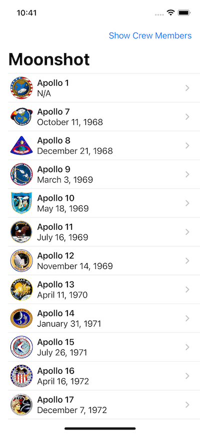

## Moonshot

Moonshot is a basic iOS App Programmed in SwiftUI to help learn Swift and SwiftUI. This is made following the 100 Days of SwiftUI series on [Hacking With Swift](https://www.hackingwithswift.com/100/swiftui).

Basic Features of this app:
* See list of some Apollo Missions
* View basic information of the mission
* View the crew members and their roles in their missions
* View detailed information of each crew member and which missions they were apart of.

### Screenshots

